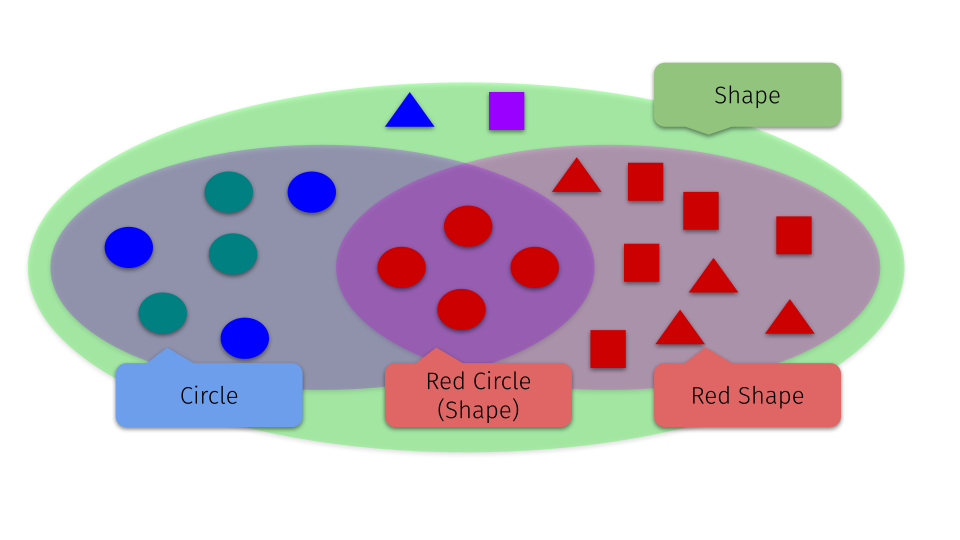

[< Back](README.md)

# 44. Concepts

* [Exercise 440](#exercise-440)
* [Exercise 441](#exercise-441)

## Exercise 440

Rewrite the operator equals in [Position.hpp][3] to use the concepts instead.

```cpp
template<typename T>
constexpr bool operator==(const BasicPosition<T> & a, const BasicPosition<T> & b) {
  return a.x == b.x && a.y == b.y;
}

template<>
constexpr bool operator==(const BasicPosition<double> & a, const BasicPosition<double> & b) {
  constexpr double epsilon = std::numeric_limits<double>::epsilon();
  return std::abs(a.x - b.x) <= epsilon &&
         std::abs(a.y - b.y) <= epsilon;
}
```

<details>
   <summary>Solution</summary>

```cpp
template<integral T>
constexpr bool operator==(const BasicPosition<T> & a, const BasicPosition<T> & b) {
    return a.x == b.x && a.y == b.y;
}

template<floating_point T>
bool operator==(const BasicPosition<T> & a, const BasicPosition<T> & b) {
    constexpr double epsilon = std::numeric_limits<T>::epsilon();
    return std::abs(a.x - b.x) <= epsilon &&
           std::abs(a.y - b.y) <= epsilon;
}

inline bool isSamePosition(const GridPosition & a, const GridPosition & b) {
  return a == b;
}

inline bool isSamePosition(const Position & a, const Position & b) {
  return a == b;
}
```
</details>

## [Exercise 441][1]
### Reason about conjunction

In the CHECKs replace the ReturnValue::Wrong with the value returned by the process function you think will be called.

```cpp
  {
    auto red_circle = circle<color::red>{};
    CHECK(process(red_circle) == ReturnValue::Wrong);
  }
  {
    auto green_circle = circle<color::green>{};
    CHECK(process(green_circle) == ReturnValue::Wrong);
  }
  {
    auto blue_circle = circle<color::blue>{};
    CHECK(process(blue_circle) == ReturnValue::Wrong);
  }
  {
    auto red_square = square<color::red>{};
    CHECK(process(red_square) == ReturnValue::Wrong);
  }
  {
    auto purple_square = square<color::purple>{};
    CHECK(process(purple_square) == ReturnValue::Wrong);
  }
  {
    auto red_triangle = triangle<color::red>{};
    CHECK(process(red_triangle) == ReturnValue::Wrong);
  }
  {
    auto blue_triangle = triangle<color::blue>{};
    CHECK(process(blue_triangle) == ReturnValue::Wrong);
  }
```

* cppreference : [Conjunctions][2]

<details>
   <summary>Hint: Picture of the relationships</summary>



</details>

<details>
   <summary>Solution</summary>

```cpp
TEST_CASE("Exercise 441 : Reason about conjunction", "[44]") {
  {
    auto red_circle = circle<color::red>{};
    CHECK(process(red_circle) == ReturnValue::Fourth);
  }
  {
    auto green_circle = circle<color::green>{};
    CHECK(process(green_circle) == ReturnValue::Second);
  }
  {
    auto blue_circle = circle<color::blue>{};
    CHECK(process(blue_circle) == ReturnValue::Second);
  }
  {
    auto red_square = square<color::red>{};
    CHECK(process(red_square) == ReturnValue::Third);
  }
  {
    auto purple_square = square<color::purple>{};
    CHECK(process(purple_square) == ReturnValue::First);
  }
  {
    auto red_triangle = triangle<color::red>{};
    CHECK(process(red_triangle) == ReturnValue::Third);
  }
  {
    auto blue_triangle = triangle<color::blue>{};
    CHECK(process(blue_triangle) == ReturnValue::First);
  }
}
```
</details>

[1]: 44_exercises.cpp
[2]: https://en.cppreference.com/w/cpp/language/constraints#Conjunctions
[3]: ../../lib/include/Position.hpp
